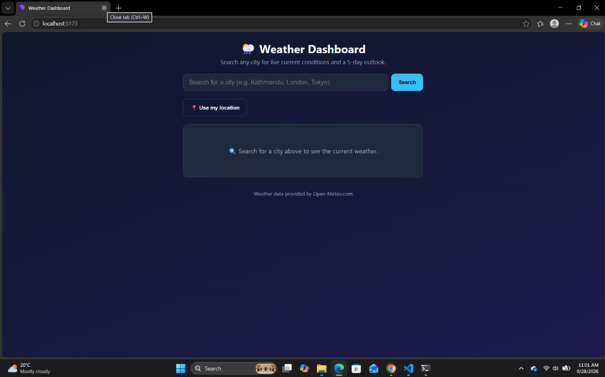
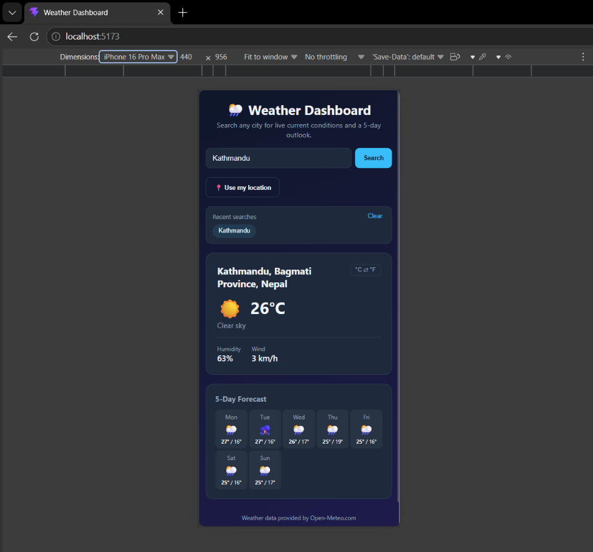
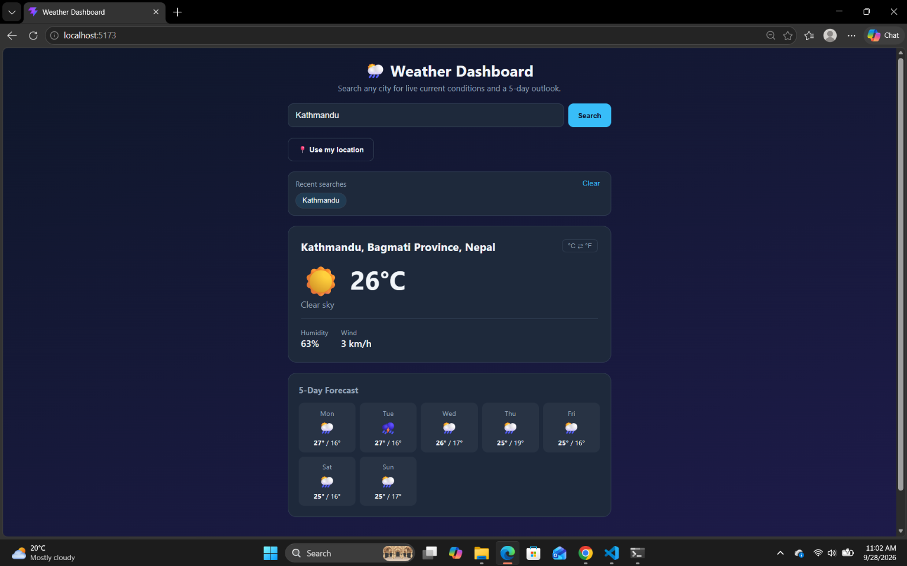

# Weather Dashboard

A single-page React app for looking up the current weather and a 5-day
forecast for any city in the world, built as a course project to practice
components, props, hooks, and event handling.

## Features

- Search any city by name and view live current conditions (temperature,
  condition, humidity, wind speed) with a matching weather icon.
- 5-day forecast strip with daily high/low temperatures.
- Toggle temperature between °C and °F.
- "Use my location" button (Geolocation API) to get weather for where you are.
- Recent-search history (up to 6 cities) that you can click to revisit —
  persisted in `localStorage` so it survives a page refresh.
- Loading, error ("city not found" / network issues), and empty states
  handled with conditional rendering.
- Responsive layout that adapts from mobile to desktop widths.

## Technologies / Libraries Used

- [React 18](https://react.dev/) (functional components + hooks only)
- [Vite](https://vitejs.dev/) as the build tool / dev server
- [Open-Meteo API](https://open-meteo.com/) — free geocoding + weather
  forecast API, no API key required
- Plain CSS (no framework) for styling

## Project Structure

```
weather-dashboard/
├── src/
│   ├── components/
│   │   ├── SearchBar.jsx        # controlled form, submits city name
│   │   ├── WeatherCard.jsx      # current conditions display
│   │   ├── ForecastList.jsx     # 5-day forecast (list rendering)
│   │   ├── SearchHistory.jsx    # recent searches (list rendering)
│   │   └── StatusMessage.jsx    # loading / error / empty states
│   ├── hooks/
│   │   └── useWeather.js        # custom hook: fetch + useState/useEffect
│   ├── utils/
│   │   └── weatherCodes.js      # WMO weather code → label/icon map
│   ├── App.jsx                  # top-level state & composition
│   ├── main.jsx                 # React entry point
│   └── index.css                # responsive styling
├── index.html
├── package.json
└── vite.config.js
```

## Setup Instructions

1. Make sure you have [Node.js](https://nodejs.org/) (v18+) installed.
2. Install dependencies:
   ```bash
   npm install
   ```
3. Run the development server:
   ```bash
   npm run dev
   ```
4. Open the printed local URL (usually `http://localhost:5173`) in your browser.

To create a production build:
```bash
npm run build
npm run preview
```

## Screenshots
Home Page


Mobile View


Weather Report


## Known Limitations

- Weather icons are emoji-based rather than custom illustrated icons.
- The city search returns only the single best geocoding match; it doesn't
  yet disambiguate between multiple cities with the same name.
- No automated tests are included.

## Live Demo

>